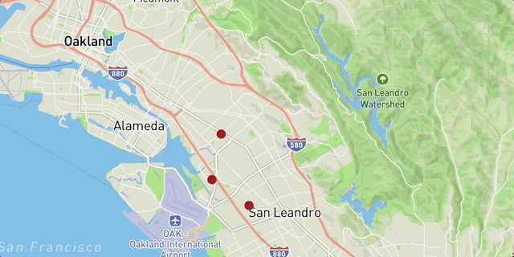
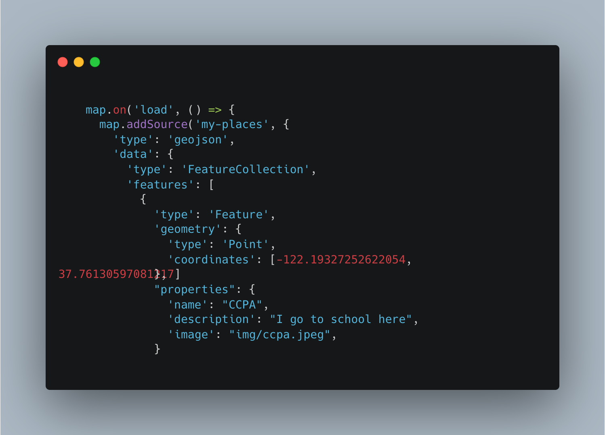

# "Important places" Map

## What did I build?

     A visual map of places important to me.

Users can see
1. **Madison Park acadmey**
2. **Coliseum College Prep Academy** 
3. **Panda express**

Here's a demo:

## Why did I build this?

I
I built this so that i could rememebr places that are somewhat important to me.

Why these places are important to me

1.  this whre i played my first ever sports game 
2. the school i go to
3.  My favorite place to eat at. Heres a demo
   

## Tech stack

To build this app, I used the following tools:

1. [Google My Maps](https://www.google.com/maps/d/u/0/), for generating the route lines, and exporting the geometries in `KML` format.
2. [Visual Studio Code](https://code.visualstudio.com/download) free IDE, with [Live Server](https://marketplace.visualstudio.com/items?itemName=ritwickdey.LiveServer) and [Markdown All in One](https://marketplace.visualstudio.com/items?itemName=yzhang.markdown-all-in-one) extensions.
3. [GitHub pages](https://docs.github.com/en/pages/getting-started-with-github-pages/creating-a-github-pages-site), for publishing the app for free!

## Code Spotlight

I highlighted this part because i struggled with this the most. Adding the coordinates properly and making sure my points were in the right place was difficult and i had to ask for help multiple times.

## Contributions

Feel free to copy the code if you want it! Comments are welcome on [this blog post](https://domlet.github.io/posts/bike-the-bay/).
